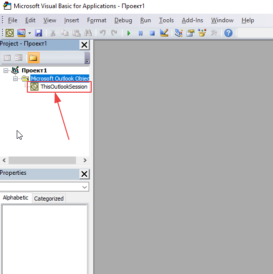

## Скрипт на VBA (Visual Basic for Applications) для Microsoft Outlook по автоответу на сообщение.

Задачей скрипта является автоответ на сообщения вида:
```
<html>
    <head></head>
    <body>
        ...
        <a href = mailto:example@example.com?subject=test_12345678_123456
        Body=Соглacие>Гарантируем</a>
        <a href = mailto:example@example.com?subject=test_12345678_123456
        Body=Несоглаcие>Нет</a>
        ...
    </body>
</html>
```
На каждое новое полученное сообщения от определенного адреса, с указанным выше содержимым, осуществляется автоответ, при котором получателем является адрес, указанный в параметре mailto, а темой письма является subject.
Иными словами, обеспечивается автоматизация нажатия на ссылку и кнопки отправки письма.

Скрипт вставляется в область "ThisOutlookSession".

После сохранения скрипта требуется перезапуск Outlook.

